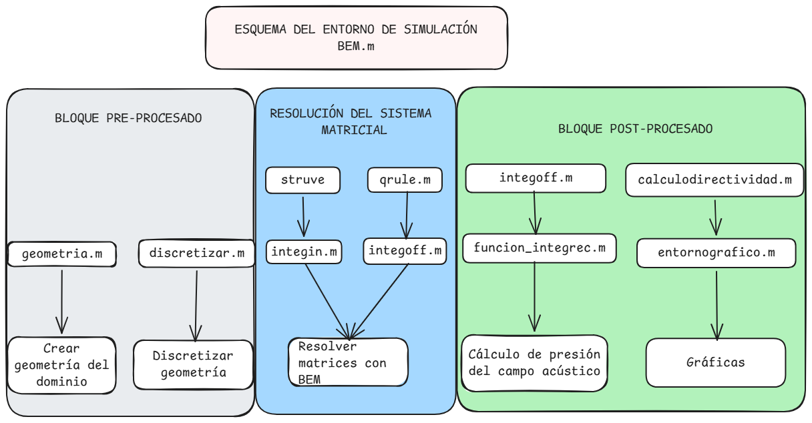

**# BEM — Simulación de radiación acústica mediante el Método de los Elementos de Contorno**


Implementación en MATLAB de un entorno de simulación basado en el \*\*Método de los Elementos de Contorno (BEM)\*\* para el estudio de la \*\*respuesta en frecuencia\*\* y la \*\*directividad\*\* de sistemas radiantes (altavoces, pistones, arrays), en 2D y 3D.


Este proyecto forma parte de mi Trabajo de Fin de Grado en Física (Universidad de Alicante), supervisado por Jaime Ramis Soriano.


**## ¿Qué hace?**


\- Resuelve el campo de presión acústica radiado por superficies vibrantes usando BEM

\- Calcula la \*\*directividad\*\* en planos horizontal y vertical

\- Calcula la \*\*respuesta en frecuencia\*\* en puntos de campo lejano

\- Incluye solvers independientes para geometrías 2D (Green de Hankel) y 3D (Green exponencial)

\- Gestiona frecuencias irregulares mediante el método CHIEF

\- Permite refinamiento de malla adaptativo por frecuencia


**## Estructura del repositorio**


```

BEM/

├── BEM\_2D/       # Solver 2D (función de Green de Hankel)

├── BEM\_3D/       # Solver 3D (función de Green exponencial)

├── examples/     # Resultados de ejemplo (imágenes)

├── LICENSE

└── README.md

```


**## Requisitos**


\- MATLAB (probado en versión R2025b)

\- No requiere toolboxes adicionales 


**## Diagrama de flujo**




**## Licencia**


Este proyecto está licenciado bajo \*\*PolyForm Noncommercial License 1.0.0\*\*. Esto significa que puedes usar, estudiar y modificar el código libremente para fines no comerciales (estudio, investigación, portfolio), pero no está permitido su uso con fines comerciales sin autorización. Consulta el archivo \[LICENSE](LICENSE) para más detalles.


**## Autora**


\*\*Eliana Arques\*\* — Graduada en Física (Universidad de Alicante)

\[GitHub](https://github.com/EliArq) · \[LinkedIn](https://linkedin.com/in/eliana-arques)

